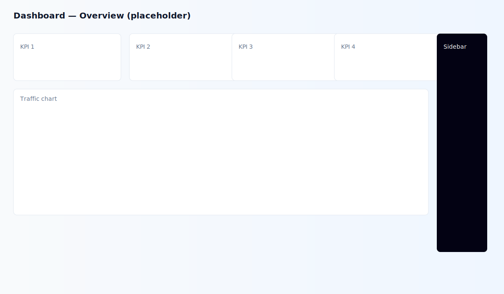
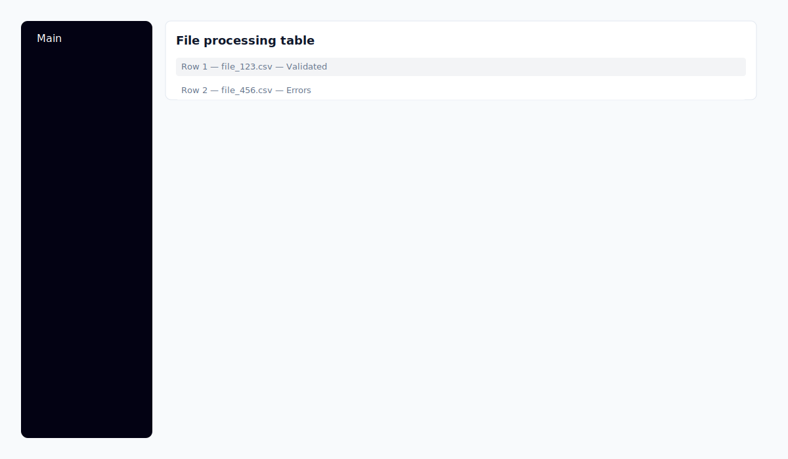
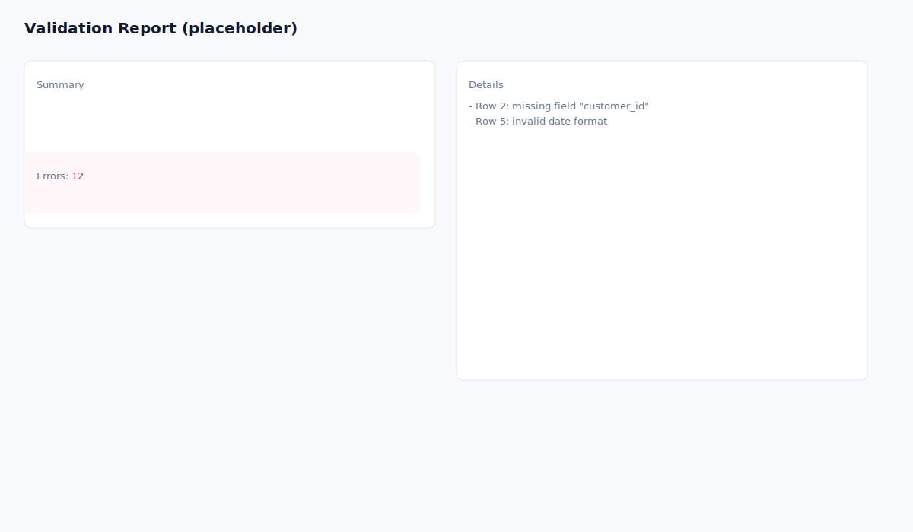

UI Technical Specification

Overview

This document lists every UI design token and technical detail found in the project theme, plus component behaviour guidance and a small visual preview. Use this as a single source of truth for colors, typography, and component semantics.

Files added
- docs/color-swatches.html — live swatch preview you can open in your browser or VS Code preview.

Color tokens

Below are the primary design tokens extracted from `src/styles/theme.css`. Each token name, value and role is shown.

Core tokens (light mode)

- --font-size: 16px
- --background: #ffffff — page background
- --foreground: oklch(0.145 0 0) — primary text color (OKLCH)
- --card: #ffffff — card surface
- --card-foreground: oklch(0.145 0 0)
- --popover: oklch(1 0 0)
- --popover-foreground: oklch(0.145 0 0)
- --primary: #030213 — primary brand color
- --primary-foreground: oklch(1 0 0)
- --secondary: oklch(0.95 0.0058 264.53)
- --secondary-foreground: #030213
- --muted: #ececf0
- --muted-foreground: #717182
- --accent: #e9ebef
- --accent-foreground: #030213
- --destructive: #d4183d — error/destructive actions
- --destructive-foreground: #ffffff
- --border: rgba(0, 0, 0, 0.1)
- --input: transparent
- --input-background: #f3f3f5
- --switch-background: #cbced4
- --font-weight-medium: 500
- --font-weight-normal: 400
- --ring: oklch(0.708 0 0) — focus ring color
- --chart-1: oklch(0.646 0.222 41.116)
- --chart-2: oklch(0.6 0.118 184.704)
- --chart-3: oklch(0.398 0.07 227.392)
- --chart-4: oklch(0.828 0.189 84.429)
- --chart-5: oklch(0.769 0.188 70.08)
- --radius: 0.625rem
- --sidebar: oklch(0.985 0 0)
- --sidebar-foreground: oklch(0.145 0 0)
- --sidebar-primary: #030213
- --sidebar-primary-foreground: oklch(0.985 0 0)
- --sidebar-accent: oklch(0.97 0 0)
- --sidebar-accent-foreground: oklch(0.205 0 0)
- --sidebar-border: oklch(0.922 0 0)
- --sidebar-ring: oklch(0.708 0 0)

Premium Data Pipeline additions

- --slate-bg: #F8FAFC
- --neon-emerald: #10B981
- --text-header: #0F172A
- --text-data: #64748B
- --error-rose: #E11D48
- --border-light: #E2E8F0
- --terminal-bg: #0F172A
- --grid-overlay: rgba(16, 185, 129, 0.04)

Dark mode overrides (.dark)

The `.dark` block in `theme.css` overrides many tokens. Examples:

- --background: oklch(0.145 0 0)
- --foreground: oklch(0.985 0 0)
- --card: oklch(0.145 0 0)
- --primary: oklch(0.985 0 0)
- --secondary: oklch(0.269 0 0)
- --muted: oklch(0.269 0 0)
- --accent: oklch(0.269 0 0)
- --destructive: oklch(0.396 0.141 25.723)
- --ring: oklch(0.439 0 0)
- chart colors and sidebar colors also have dark variants.

Usage patterns and intent

- Semantic tokens: Use `--color-*` mapping shown via `@theme inline` in `theme.css` to consume tokens semantically (e.g. `--color-primary`, `--color-destructive`).
- Accessibility: Primary foreground / background contrast should be validated (WCAG AA/AAA) when customizing colors. `--ring` is used for the focus outline.
- State colors: Hover/active states are not explicitly defined as tokens. Recommended pattern:
  - hover: color-mix(in srgb, var(--color-primary) 85%, black 15%) or use a 5-10% darker variant computed at build time.
  - disabled: apply 40% opacity to foreground or use `--muted-foreground`.

Components & behaviors (summary)

Buttons (semantic types):
- Primary — uses `--color-primary` background and `--color-primary-foreground` text. Function: main call-to-action.
- Secondary — uses `--color-secondary` background and `--color-secondary-foreground` text. Function: secondary actions.
- Destructive — uses `--color-destructive` background and `--color-destructive-foreground` text. Function: destructive or destructive-confirmation actions.
- Accent / Ghost — use `--color-accent` and transparent backgrounds. Function: auxiliary actions, toggles.
- Muted — uses `--color-muted` with `--color-muted-foreground` for subtle actions.

States to implement for all buttons:
- default, hover, active, focus (outline uses `--color-ring`), disabled (reduced opacity, pointer-events none), loading (spinner inside button and aria-live announced message).

Inputs / Forms
- Background: `--color-input-background`
- Border: `--color-border`
- Focus ring: `--color-ring`
- Disabled/readonly: reduce contrast using `--muted` and `--muted-foreground`.

Sidebar
- Background: `--color-sidebar`
- Primary items: `--color-sidebar-primary` with `--color-sidebar-primary-foreground`
- Accents/selected states: `--color-sidebar-accent`

Charts
- Use `--color-chart-1..5` for categorical series. Also provide accessible alternatives for color-blind users (patterns, dashed lines).

Typography
- Base font size: `--font-size` (16px)
- Headings use Tailwind tokens referenced in `@layer base` (e.g. `var(--text-2xl)`) and `--font-weight-medium`.
- Body and labels use `--font-weight-normal` and `--text-base`.

Code examples

CSS (consuming tokens):

```css
.button-primary {
  background: var(--color-primary);
  color: var(--color-primary-foreground);
  border-radius: var(--radius);
  font-weight: var(--font-weight-medium);
}

.button-primary:focus {
  outline: 2px solid var(--color-ring);
  outline-offset: 2px;
}
```

React (JSX):

```jsx
<button className="button-primary" aria-pressed="false">Confirm</button>
```

Visual preview

Open `docs/color-swatches.html` in VS Code or your browser to view swatches for the main tokens. The preview reproduces the token values from `theme.css` and shows light + dark variants.

How to add or change tokens

1. Edit `src/styles/theme.css` — add, remove or modify the `--` variables.
2. Keep semantic mapping in `@theme inline` in sync.
3. Update `docs/color-swatches.html` if you want the preview to include additional tokens.

Screenshots (inline)

The screenshots below are embedded SVG placeholders that reflect the project's theme tokens. Open this markdown file in VS Code or a Markdown viewer to see the images inline. If you later replace the SVG files with real screenshots, the images will update automatically.

### Dashboard overview



Caption: High-level overview with KPIs and main chart area (placeholder).

---

### Sidebar and file table



Caption: Sidebar navigation and the file processing table (placeholder).

---

### Validation report



Caption: Validation report summary and detailed errors (placeholder).

Preview instructions

1. In VS Code: open `docs/UI-TECHNICAL-SPEC.md` and use the Markdown preview to view images inline.
2. In a browser: open the markdown via an extension or export to HTML/print-to-PDF.

Exporting to a single PDF

- Option A (VS Code): Open the markdown preview, right-click the preview and use the "Save as PDF" or use an extension such as "Markdown PDF".
- Option B (Command line): convert with pandoc (if installed):
  pandoc docs/UI-TECHNICAL-SPEC.md -o UI-TECHNICAL-SPEC.pdf --pdf-engine=wkhtmltopdf

Notes

- These are currently placeholders. If you want screenshots captured from the running application, I can start the dev server and take real screenshots and then update these images. This requires permission to run the dev server commands.

Notes / next steps
- If you want, I can:
  - generate an exported PDF or PNG of the swatch sheet.
  - add per-component specs (spacing, iconography, exact hover color values) and example screenshots.
  - compute WCAG contrast ratios for each foreground/background pair and list any violations.

